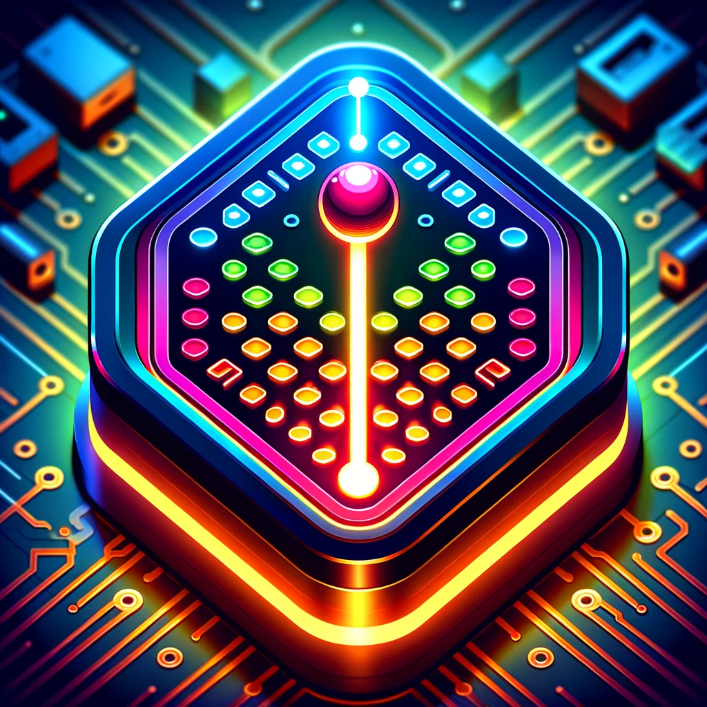
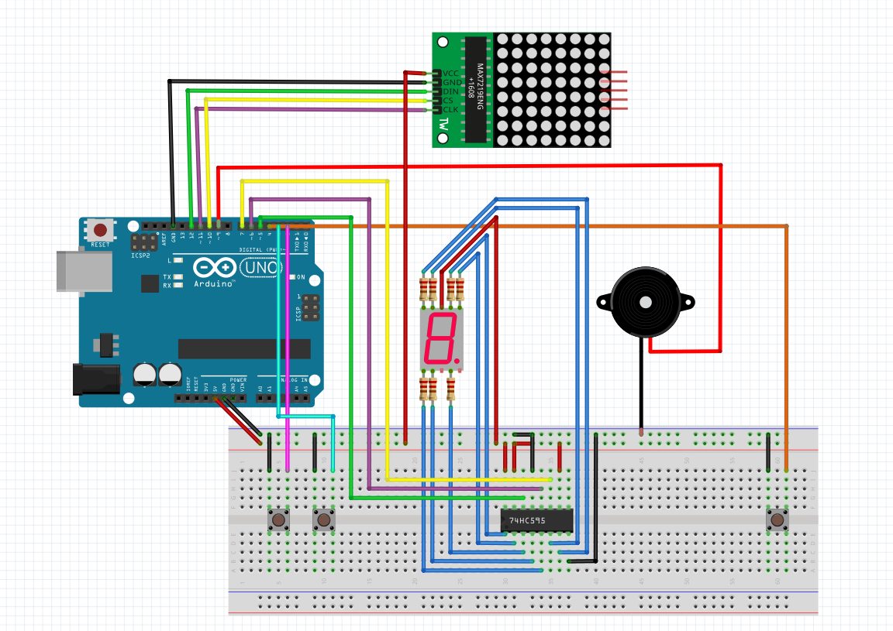

#  Uno Shooter

## Description

Uno Shooter is a fast-paced, arcade-style game made as a university homework task. It is designed to be played on 8x8 LED matrix display, providing a retro gaming feel. Player can control the character using three buttons: left, right, and fire. Each button press is intuitively mapped to the character actions on the display. The goal is to shoot as many enemies as possible before they reach the player level. Each round of the game lasts for 7*X seconds, a period determined by the enemy drop interval of X seconds. Additionally, the game features a digital counter that visually indicates the time remaining before an enemy descends to the next row, and a buzzer for some feedback sounds.

_Suggested interval period that is currently hardcoded - 5 seconds._


## Hardware Requirements

### Components List

This is a list of components that are essential for this project:
- Arduino UNO and its cable
- Breadboard
- 8x8 LED Matrix MAX7219
- 7-Segment display 5011BS
- 74HC59 shift register
- Piezo buzzer
- Buttons (3)
- Resistors (7)
- Wires (many)

### Circuit Diagram




## Libraries

One external [library](http://wayoda.github.io/LedControl/index.html) has been used:
```
#include "LedControl.h"
```

It allows to control our 8x8 LED display through MAX7219 driver a lot easier. Library also supports up to 8 daisy chained MAX72XX drivers if we would decide to expand the game in the future.

Two mainly used library functions:
- `clearDisplay` - completely resets the 8x8 LED matrix
- `setLed` - turns on/off one specific LED in the matrix


## Technical Implementation

### Pull-up Resistors

Digital inputs for the buttons utilize the Arduino internal pull-up resistors, enabled by setting the pins as `INPUT_PULLUP`. This approach simplifies the circuit by not requiring external pull-up resistors and ensures a stable high signal when the buttons are not pressed.

### Interrupts

The game leverages various types of interrupts to ensure a responsive and non-blocking user input.

Hardware interrupts are used for the left and right button inputs, attached to the Arduino digital pins 2 and 3, respectively. These interrupts are triggered on the falling edge of the signal, which occurs when the button is pressed. A pin change interrupt handles the fire button on pin 4, monitoring changes in the state of the pin. Interrupt Service Routines (ISRs) for these buttons set flags that are later checked in the main loop, a method which avoids long-running operations within an ISR itself and keeps the game responsive.

In addition, Arduino Timer1 is configured to generate an interrupt request every second. It is used to the enemy drop timer.

### Button Debouncing

To mitigate the mechanical noise in button presses, a simple software debouncing technique is implemented. Each ISR responsible for button handling employs a simple timing mechanism: it ensures that a certain amount of time (hardcoded value is 75 milliseconds) has elapsed since the last registered button press. This effectively filters out rapid, unintended multiple signals from a single button press.

### Display Control

The 8x8 LED matrix display is managed by the LedControl library which handles the on/off state of individual LEDs, crucial for representing game elements. By updating only necessary LEDs rather than refreshing the entire display, the game maintains a high level of performance. For the 7-segment display, a shift register is used that is connected via three digital output pins. This technique allows for the control of multiple segments using fewer Arduino pins. By shifting out the binary representation of the desired number to the display, a countdown timer is efficiently updated without occupying additional pins for each segment.

### Sound Effects

Sound feedback is provided through a piezo buzzer connected to pin 9. Function `tone` is used to generate different frequencies for different game events: firing a bullet or hitting an enemy with it. The use of `tone` function allows a non-blocking sound generation which is critical for maintaining the game flow.

### Main Loop and Game Logic

Main `loop` function checks the flags set by the interrupts and executes corresponding actions, such as moving the player, updating the enemy position, and handling bullet animations. The game logic ensures that the enemy moves and reappears randomly. When an enemy reaches player level, `score_animation` function visually represents the player score at the end of each game by filling the matrix in a sequential manner, turning on one LED at a time. After that, fire button can be pressed to start a new game.


## Game Mechanics

The player, represented by a dot on the bottom row of the 8x8 LED matrix, can move left or right and shoot bullets upwards. In the beginning, an enemy appear on the top matrix row. It drops down one row at a time at fixed intervals, also shifting sideways, making the game a little bit more dynamic. Uno Shooter uses a looping playfield: both the player and the enemy can pass through one side of the display and reappear on the other. The player must quickly determine a shortest path to the enemy position while strategically utilizing 7-segment countdown timer to anticipate the next enemy move.

## Gameplay Demos

https://github.com/dovydasju/uno-shooter/assets/33726370/1e382a8c-1945-4960-8d9c-53ecd92221f0

https://github.com/dovydasju/uno-shooter/assets/33726370/a8fb4db0-58cb-4449-951e-59eacde8e635

https://github.com/dovydasju/uno-shooter/assets/33726370/ce009143-ac46-463f-97d1-d57af3620760

https://github.com/dovydasju/uno-shooter/assets/33726370/eceeb376-5caf-4f2e-beef-504c09e21efe

https://github.com/dovydasju/uno-shooter/assets/33726370/b2e41d9b-0110-4885-b142-1752f9304ebc


